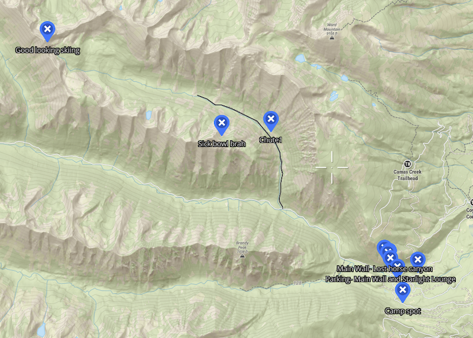
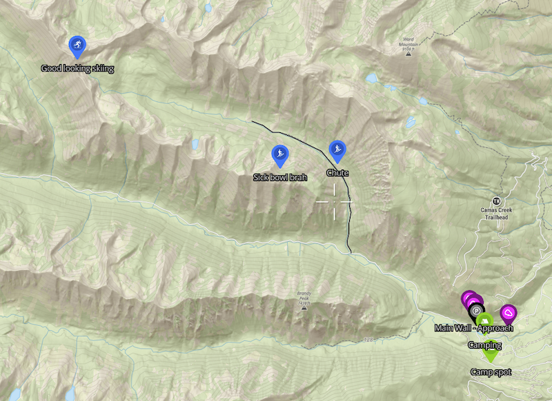

# Cairn

**Work in progress, buyer beware.**
## Quick start

**Installation**

```shell
# Install uv if you don't have it
curl -LsSf https://astral.sh/uv/install.sh | sh

# Clone and install
git clone https://github.com/moltude/cairn.git
cd cairn

uv sync # Or if that fails then 'uv pip install -e .'

# Run the app
uv run cairn tui
```

### Why?

I'm an advocate for open data and being able to exchange map data between platforms. GPX/KML/GeoJSON are meant to be platform-agnostic interchange formats (or at least that's how I understand them). Cairn is my attempt to make that promise feel real for backcountry mapping: move between OnX and CalTopo while taking *all the map customization with you* (icons, colors, notes, and organization), not just raw shapes.

This tool started as an experiment and it surfaced a number of challenges. I'm not an expert — if my assumptions are wrong, I want to find out and correct them. The goal is a faithful migration, not "a file that happens to import."

### So what?

In theory, these formats should make it easy to move between map platforms. In practice, platforms tend to:

- support only a subset of each format
- add non-standard fields or extensions
- rewrite data during import/export (sometimes subtly)

I built Cairn to make migration between systems easier *without losing the customization that makes a map valuable* (names, notes, colors, icons, and organizational intent) — not just the raw shapes. I have only developed this for **onX Backcountry** and **CalTopo** but there are other platforms out there.

### Icon, Symbol and Color Mapping

The real value of Cairn is migrating the colors, icons, names and descriptions because these not incldues by onX's import tool. Another benefit is being able to preview the data and do batch updating before importing which is something that is not easy (or possible) to do in the app. Beyond just the aesthics there is real value to proper onX icons and colors.

**Why is icon and color mapping important for onX?**

onX supports discovery by searching across everything or within a specific content type. However, the only way to filter is by **Color** and **Icon** for waypoints.

Color is a key filtering property in onX's **My Content** window. When importing waypoints from CalTopo, having colors correctly mapped allows you to:
- Filter large sets of imported waypoints by color and icon
- Quickly find waypoints by combining text + filtering
- Maintain an organizational structure

### A Story

*Hey buddy! Heard you were heading up my way, here is a GPX file with some choice spots!*
[cool-spots.gpx](cool-spots.gpx)

That GPX file they made contains details of an area and lots of information, hiking and backpacking routes, great rock climbing, a cool tower and fishing spots. There are important waypoints that indicate hazards, water sources and approaches. When they constructed this dataset they took the time to assign colors, icons and other metadata beyond the lines, dots and polygons to help you and others make the most of this map.

<!-- I am commenting out some of this until I have a more fully implemented CalTopo < -- > onX migration. Right now it is just CalTopo -> onX  -->
😍 CalTopo 😍 | 🤬  onX 🤬 | 😍 Cairn + onX 😍
:-------------------------:|:-------------------------:|:-------------------------:
 |  | 


## License

MIT License - see [LICENSE](LICENSE)
