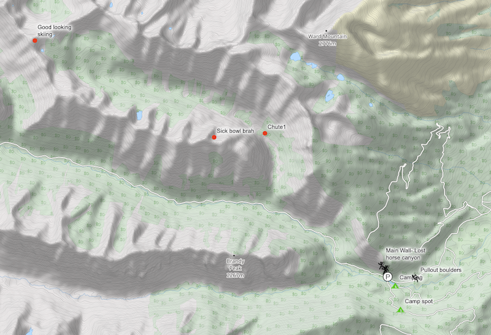
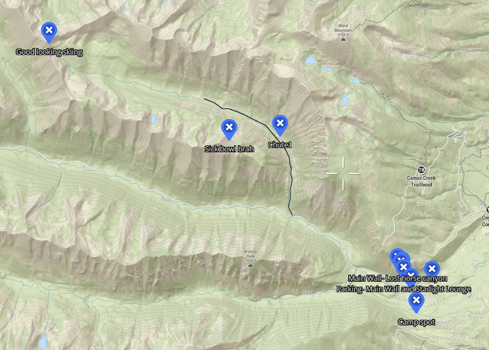
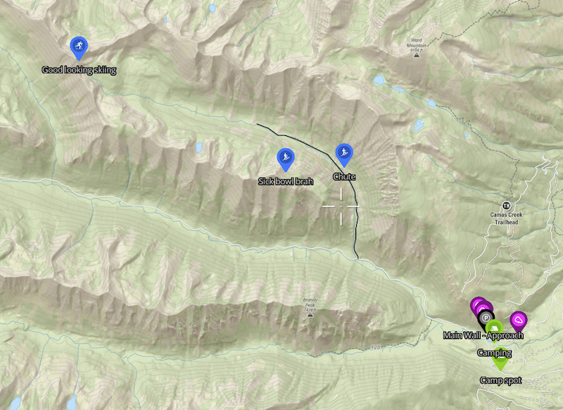

# Cairn

**Work in progress, buyer beware.**

## Try it in the browser

Cairn also runs entirely client-side as a web app (the same Python engine, via
[Pyodide](https://pyodide.org)) — your map file never leaves your computer. A hosted
version is being set up at `quietmarch.to/cairn`; until then, run it locally:

```shell
uv run python web/serve.py   # then open http://127.0.0.1:8765
```

See [`web/README.md`](web/README.md) for how the prototype works and
[`docs/VERCEL_DEPLOY_PLAN_2026-08-30.md`](docs/VERCEL_DEPLOY_PLAN_2026-08-30.md)
for the deployment plan.

## Quick start

**Installation**

Cairn is not on PyPI yet (the distribution name will be `cairn-maps`; the command stays `cairn`).
For now, install from source:

```shell
# Install uv if you don't have it
curl -LsSf https://astral.sh/uv/install.sh | sh

# Clone and install
git clone https://github.com/moltude/cairn.git
cd cairn

uv sync --all-extras   # --all-extras also installs the test dependencies

# Run the app
uv run cairn tui
```

**Usage**

```shell
cairn tui                                  # full-screen interactive app
cairn migrate onx <file>                   # CalTopo -> onX  (.json / .geojson / .gpx)
cairn migrate caltopo <file>               # onX -> CalTopo  (.gpx / .kml)
```

Useful flags and settings:

| | |
|---|---|
| `--debug` | Include Cairn's internal fields (`id=`, `color=`, `icon=`) in each `<desc>`. By default `<desc>` carries only your own notes. |
| `--output-dir <path>` | Where to write the generated files. |
| `--no-sort` | Preserve the original order instead of natural sorting. |
| `--max-gpx-mb` | Size cap before auto-splitting (onX's import limit is 4 MB; default 3.75). |
| `CAIRN_DEBUG_LOG=<path>` | Opt in to structured debug logging. Off by default. |
| `CAIRN_ICON_CATALOG=<path>` | Opt in to recording which CalTopo symbols you encounter. Off by default. |

### Why?

I'm an advocate for open data and being able to exchange map data between platforms. GPX/KML/GeoJSON are meant to be platform-agnostic interchange formats (or at least that's how I understand them). Cairn is my attempt to make that promise feel real for backcountry mapping: move between OnX and CalTopo while taking *all the map customization with you* (icons, colors, notes, and organization), not just raw shapes.

This tool started as an experiment and it surfaced a number of challenges. I'm not an expert — if my assumptions are wrong, I want to find out and correct them. The goal is a faithful migration, not "a file that happens to import."

### So what?

In theory, these formats should make it easy to move between map platforms. In practice, platforms tend to:

- support only a subset of each format
- add non-standard fields or extensions
- rewrite data during import/export (sometimes subtly)

I built Cairn to make migration between systems easier without losing the customization that makes a map valuable: names, notes, colors, icons, and organizational intent. Not just the raw shapes. I have only developed this for onX Backcountry and CalTopo but there are other platforms out there.

### Icon, Symbol and Color Mapping

The real value of Cairn is migrating the stuff that makes a dataset usable in onX: names, descriptions, colors, and icons. onX supports markup options and describes using them when managing saved items. [[2]](#ref-2) [[3]](#ref-3)

Cairn’s job is to carry those attributes over so your import doesn’t flatten everything into “just points and lines”.

### What Cairn does

- 1:1 mapping: Cairn does not decide what you should import or filter anything out. It maps what you give it into what it exports.
- Preview + batch updates: Cairn lets you preview and batch-update waypoint metadata before you generate the GPX you’ll import. [[2]](#ref-2) [[3]](#ref-3)
- Works around import constraints: onX documents import constraints and common failure modes. Cairn aims to make those constraints easier to live with. [[1]](#ref-1) [[5]](#ref-5)
  - It automatically splits exports into GPX files under the documented size cap.
  - It writes waypoints and tracks or routes into separate GPX files so they can be imported separately.
### Why do this before importing?

onX documents that large markup collections can affect app performance and provides guidance on managing markups. [[4]](#ref-4)

Cairn doesn't change onX's limits. It just helps you arrive with your organization intact.

> "GPX: This is a commonly used file type, you lose line and marker style, and folder organization." [[7]](#ref-7)

### CalTopo GPX Support

Cairn now supports CalTopo GPX exports as input. However, CalTopo GPX exports are significantly more limited than GeoJSON:

| Feature | GeoJSON | GPX |
|---------|---------|-----|
| Coordinates | ✅ | ✅ |
| Names | ✅ | ✅ |
| Icons/Symbols | ✅ | ❌ |
| Colors | ✅ | ❌ |
| Folder Structure | ✅ | ❌ |
| Descriptions | ✅ | ❌ (usually) |

**The value of Cairn for GPX imports is enriching your data.** Since GPX files contain only coordinates and names, Cairn's editing steps become essential:

- **Assign icons** to waypoints based on their purpose (camp, water, hazard, etc.)
- **Set colors** for routes and waypoints
- **Add descriptions** for context

Cairn will suggest icons based on keywords in waypoint names (e.g., "Camp spot" → Campsite icon), but walking through the editing steps lets you customize before export.

**Recommendation**: When possible, export from CalTopo as GeoJSON for full fidelity. Use GPX when that's your only option, and use Cairn to add the metadata that GPX cannot store.

Both the TUI and `cairn migrate onx` accept `.gpx`; Cairn will tell you up front what GPX cannot carry. If a directory holds both a `.json` and a `.gpx` export of the same map, Cairn offers the GeoJSON first, since choosing the GPX silently loses your icons, colors and folders.

### A Story

*Hey buddy! Heard you were heading up my way, here is a GPX file with some choice spots!*
[cool-spots.gpx](cool-spots.gpx)

That GPX file they made contains details of an area and lots of information, hiking and backpacking routes, great rock climbing, a cool tower and fishing spots. There are important waypoints that indicate hazards, water sources and approaches. When they constructed this dataset they took the time to assign colors, icons and other metadata beyond the lines, dots and polygons to help you and others make the most of this map.

<!-- I am commenting out some of this until I have a more fully implemented CalTopo < -- > onX migration. Right now it is just CalTopo -> onX  -->
😍 CalTopo 😍 | 🤬  onX 🤬 | 😍 Cairn + onX 😍
:-------------------------:|:-------------------------:|:-------------------------:
 |  | 

## References

<a id="ref-1"></a>
[1] [Importing and Exporting Markups (Waypoints, Routes, Lines, Shapes, and Tracks)](https://onxbackcountry.zendesk.com/hc/en-us/articles/360057195972-Importing-and-Exporting-Markups-Waypoints-Routes-Lines-Shapes-and-Tracks)

<a id="ref-2"></a>
[2] [Editing and organizing Markups (Waypoints, Routes, Lines, Shapes, and Tracks)](https://onxbackcountry.zendesk.com/hc/en-us/articles/360052239052-Editing-and-organizing-Markups-Waypoints-Routes-Lines-Shapes-and-Tracks)

<a id="ref-3"></a>
[3] [Using Markup options](https://onxbackcountry.zendesk.com/hc/en-us/articles/5013855682445-Using-Markup-options)

<a id="ref-4"></a>
[4] [Managing Markups to improve the performance of the onX Backcountry App](https://onxbackcountry.zendesk.com/hc/en-us/articles/4402358311053-Managing-Markups-to-improve-the-performance-of-the-onX-Backcountry-App)

<a id="ref-5"></a>
[5] [There was an error when I imported Markups (Waypoints, Routes, Lines, Shapes, and Tracks)](https://onxbackcountry.zendesk.com/hc/en-us/articles/5022588722317-There-was-an-error-when-I-imported-Markups-Waypoints-Routes-Lines-Shapes-and-Tracks)

<a id="ref-6"></a>
[6] [Transferring your saved items from CalTopo into onX Backcountry](https://onxbackcountry.zendesk.com/hc/en-us/articles/4446611009165-Transferring-your-saved-items-from-CalTopo-into-onX-Backcountry)

<a id="ref-7"></a>
[7] [CalTopo: Exporting Objects](https://training.caltopo.com/all_users/import-export/export)

## License

MIT License - see [LICENSE](LICENSE)
