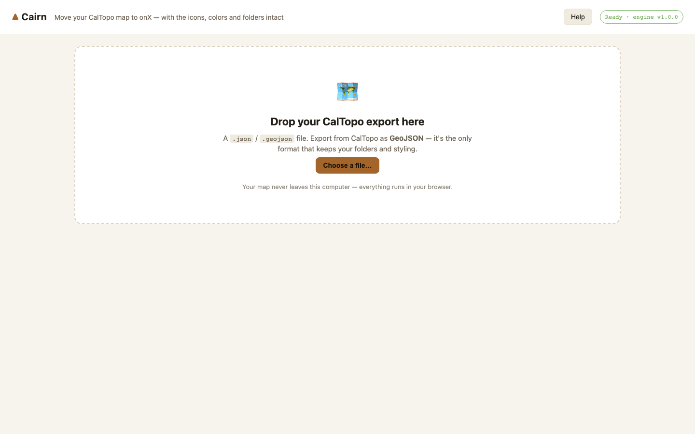
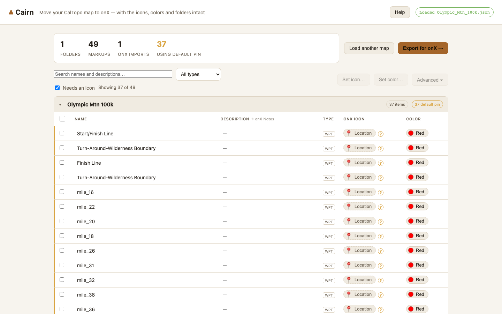
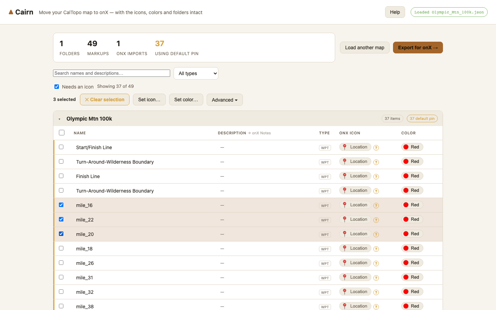
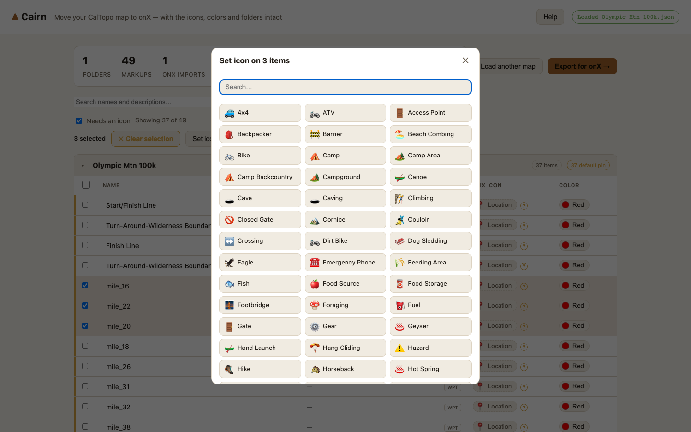
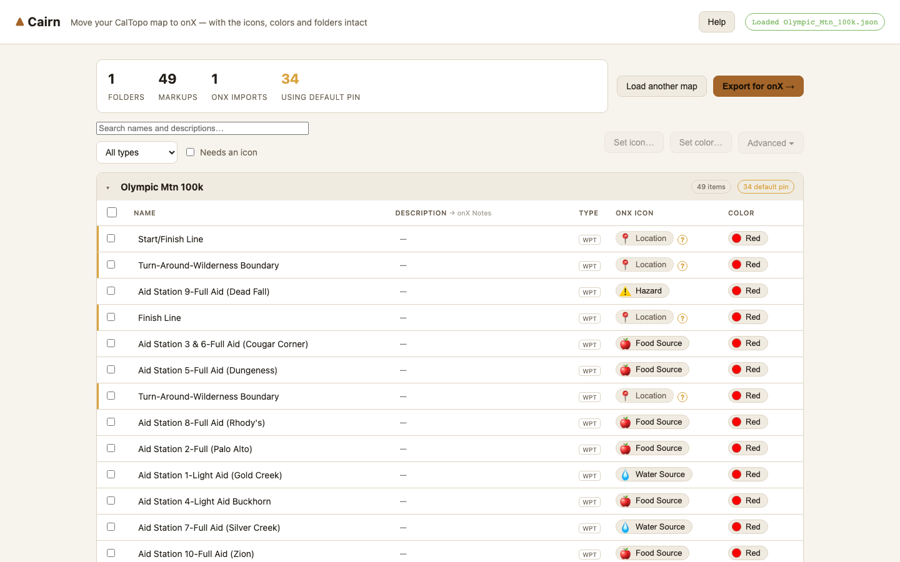
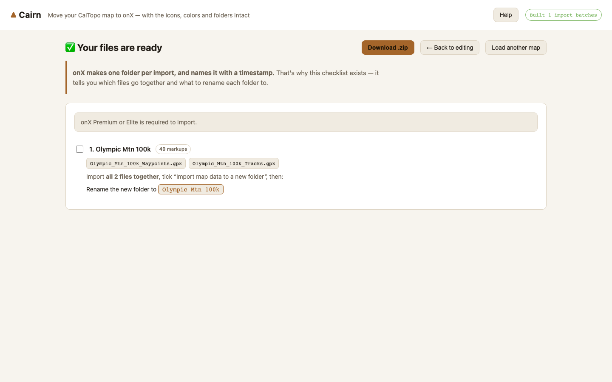

# Cairn

**Work in progress, buyer beware.**

## Try it in the browser

Cairn runs entirely client-side as a web app (the same Python engine, via
[Pyodide](https://pyodide.org)) — your map file never leaves your computer. This is the primary
way to use Cairn:

**[quietmarch.to/cairn](https://quietmarch.to/cairn)**

To run it locally instead:

```shell
uv run python web/serve.py   # then open http://127.0.0.1:8765
```

See [`web/README.md`](web/README.md) for how the web app works and
[`docs/VERCEL_DEPLOY_PLAN_2026-08-30.md`](docs/VERCEL_DEPLOY_PLAN_2026-08-30.md)
for how it's deployed.

### A walkthrough

A real transformation, start to finish — a 100k trail race's aid stations, mile splits and
course lines exported from CalTopo as GeoJSON.

**1. Drop the file.** Nothing uploads anywhere; this all runs in your browser.



**2. Review what came in.** 49 markups across aid stations, mile markers and the course lines,
each already given a best-guess onX icon and color.


**3. Filter to what needs a human decision.** 37 waypoints — mostly generic mile markers —
fell back to onX's default pin because nothing in CalTopo matched. That's often fine (a mile
split doesn't need its own icon), but it's a one-click way to see exactly what's still
unresolved.



**4. Select the ones worth fixing.** Here, three mile-marker waypoints.



**5. Set an icon on all of them at once.** No editing one waypoint at a time.



The attention count drops from 37 to 34 — exactly the 3 waypoints just fixed.



**6. Export, and get an import checklist, not just a pile of files.** onX creates one folder per
import and names it with a timestamp — never from the filename — so Cairn tells you exactly
which files to drag in together and what to rename the folder to.



### Why?

I'm an advocate for open data and being able to exchange map data between platforms. GPX/KML/GeoJSON are meant to be platform-agnostic interchange formats (or at least that's how I understand them). Cairn is my attempt to make that promise feel real for backcountry mapping: move between OnX and CalTopo while taking *all the map customization with you* (icons, colors, notes, and organization), not just raw shapes.

This tool started as an experiment and it surfaced a number of challenges. I'm not an expert — if my assumptions are wrong, I want to find out and correct them. The goal is a faithful migration, not "a file that happens to import."

### So what?

In theory, these formats should make it easy to move between map platforms. In practice, platforms tend to:

- support only a subset of each format
- add non-standard fields or extensions
- rewrite data during import/export (sometimes subtly)

I built Cairn to make migration between systems easier without losing the customization that makes a map valuable: names, notes, colors, icons, and organizational intent. Not just the raw shapes. I have only developed this for onX Backcountry and CalTopo but there are other platforms out there.

### What Cairn does

- 1:1 mapping: Cairn does not decide what you should import or filter anything out. It maps what you give it into what it exports.
- Preview + batch updates: Cairn lets you preview and batch-update waypoint metadata before you generate the GPX you'll import. [[2]](#ref-2) [[3]](#ref-3)
- Works around import constraints: onX documents import constraints and common failure modes. Cairn aims to make those constraints easier to live with. [[1]](#ref-1) [[5]](#ref-5)
  - It automatically splits exports into GPX files under the documented size cap.
  - It writes waypoints and tracks or routes into separate GPX files so they can be imported separately.

### Icon, Symbol and Color Mapping

The real value of Cairn is migrating the stuff that makes a dataset usable in onX: names, descriptions, colors, and icons. onX supports markup options and describes using them when managing saved items. [[2]](#ref-2) [[3]](#ref-3)

Cairn's job is to carry those attributes over so your import doesn't flatten everything into "just points and lines".

#### Why is icon and color mapping important for onX?

onX supports discovery by searching across everything or within a specific content type. However, the only way to filter is by **Color** and **Icon** for waypoints.

Color is a key filtering property in onX's "My Content" feature. When importing waypoints from CalTopo, having colors correctly mapped allows you to:
- Filter large sets of imported waypoints by color and icon
- Quickly find waypoints by combining text + filtering
- Maintain an organizational structure

onX only allows specific colors and icon terms to be used.

See the color reference table below for the allowed onX colors. If the data you want to import provides color information, Cairn will convert it to the closest onX color. If no color is provided then onX will use the default blue.

For icons and symbols, onX accepts a set of ~40 icons but CalTopo exports a much larger set. Even when the icons are visually identical the text labels used may not match and the icon doesn't transfer. When the icon does not match in onX the default  will be used.

Cairn maintains a default mapping of common CalTopo --> onX icons. When it can't map one, the web
app marks that waypoint amber and falls back to onX's default pin — filter to **"Needs an icon"**
to see just those, then set an icon on them (individually or in bulk) before you export. Nothing
is silently dropped; it's just flagged for a quick human decision.

*(Prefer to pre-map symbols permanently instead of fixing them per-export? See
["Custom icon mappings"](#custom-icon-mappings-command-line) under Command line.)*

#### Color reference

There are 10(ish) official OnX colors. Waypoints support **10** colors and Tracks/Lines support **11**, all of the previous 10 plus Fuchsia.

| #  | Color Name   | RGBA Value           | RGB              | Hex                                                                                  | In Waypoints? |
|----|--------------|----------------------|------------------|--------------------------------------------------------------------------------------|---------------|
| 1  | Red-Orange   | `rgba(255,51,0,1)`   | RGB(255, 51, 0)  |  `#FF3300` | ✅ Yes |
| 2  | Blue         | `rgba(8,122,255,1)`  | RGB(8, 122, 255) |  `#087AFF` | ✅ Yes |
| 3  | Cyan         | `rgba(0,255,255,1)`  | RGB(0, 255, 255) |  `#00FFFF` | ✅ Yes |
| 4  | Lime         | `rgba(132,212,0,1)`  | RGB(132, 212, 0) |  `#84D400` | ✅ Yes |
| 5  | Black        | `rgba(0,0,0,1)`      | RGB(0, 0, 0)     |  `#000000` | ✅ Yes |
| 6  | White        | `rgba(255,255,255,1)`| RGB(255, 255, 255)|  `#FFFFFF` | ✅ Yes |
| 7  | Purple       | `rgba(128,0,128,1)`  | RGB(128, 0, 128) |  `#800080` | ✅ Yes |
| 8  | Yellow       | `rgba(255,255,0,1)`  | RGB(255, 255, 0) |  `#FFFF00` | ✅ Yes |
| 9  | Red          | `rgba(255,0,0,1)`    | RGB(255, 0, 0)   |  `#FF0000` | ✅ Yes |
| 10 | Brown        | `rgba(139,69,19,1)`  | RGB(139, 69, 19) |  `#8B4513` | ✅ Yes |
| 11 | Fuchsia      | `rgba(255,0,255,1)`  | RGB(255, 0, 255) |  `#FF00FF` | ❌ No (track-only) |

### Why do this before importing?

onX documents that large markup collections can affect app performance and provides guidance on managing markups. [[4]](#ref-4)

Cairn doesn't change onX's limits. It just helps you arrive with your organization intact.

> "GPX: This is a commonly used file type, you lose line and marker style, and folder organization." [[7]](#ref-7)

### CalTopo GPX Support

Cairn now supports CalTopo GPX exports as input. However, CalTopo GPX exports are significantly more limited than GeoJSON:

| Feature | GeoJSON | GPX |
|---------|---------|-----|
| Coordinates | ✅ | ✅ |
| Names | ✅ | ✅ |
| Icons/Symbols | ✅ | ❌ |
| Colors | ✅ | ❌ |
| Folder Structure | ✅ | ❌ |
| Descriptions | ✅ | ❌ (usually) |

**The value of Cairn for GPX imports is enriching your data.** Since GPX files contain only coordinates and names, Cairn's editing steps become essential:

- **Assign icons** to waypoints based on their purpose (camp, water, hazard, etc.)
- **Set colors** for routes and waypoints
- **Add descriptions** for context

Cairn will suggest icons based on keywords in waypoint names (e.g., "Camp spot" → Campsite icon), but walking through the editing steps lets you customize before export.

**Recommendation**: When possible, export from CalTopo as GeoJSON for full fidelity. Use GPX when that's your only option, and use Cairn to add the metadata that GPX cannot store.

Both the web app and CLI accept `.gpx`; Cairn will tell you up front what GPX cannot carry.
(The CLI/TUI's file browser goes a step further: if a directory holds both a `.json` and a
`.gpx` export of the same map, it offers the GeoJSON first, since choosing the GPX silently
loses your icons, colors and folders.)

### Known quirks, blockers and things I learned along the way

*If any of my assumptions are wrong, I want to know — the goal is a faithful migration.*

- **OnX export variance**: similar "linework" can export as `<trk>` vs `<rte>`. Areas/polygons often only appear as polygons in KML.
- **CalTopo's exported "GeoJSON" is CalTopo-flavored**: it may include extra properties and 4D coordinate arrays like `[lon, lat, ele, time]`. I treat this as normal normalization, not automatically a bug.
- **Standards aren't fully standard in practice**: GPX/KML/GeoJSON are interchange formats, but platform behavior still matters more than file validity.
- **Ordering is not reliable after import**: even if I carefully write GPX/KML in a particular order, OnX may re-order items in folders after import and there isn't a stable user-visible "sort by name" / "sort by import order" workflow that guarantees the same outcome every time.
- **Waypoints and tracks use the same base colors, but tracks have one extra**: OnX waypoints support 10 colors, while tracks/lines support 11 colors. The first 10 colors are identical between waypoints and tracks. Tracks have one additional color (Fuchsia) that waypoints don't support.
- **Feature with geometry: null.** CalTopo exports GeoJSON that matches their internal model by using Features with `geometry: null` to represent folder organization (with other features linked via folderId), and by sometimes emitting 4-value coordinate arrays like [lon, lat, 0, 0] even though [RFC 7946](https://datatracker.ietf.org/doc/html/rfc7946) positions are intended to be 2D/3D. Cairn handles these CalTopo-specific patterns by parsing them into a normalized internal document model (folders + waypoints + tracks/shapes) and then exporting standards-based GPX/KML for OnX import, avoiding those GeoJSON interoperability pitfalls.

#### Dedupping

During this experiment I found cases where OnX exports include many distinct objects (different IDs) with identical names and identical geometry. CalTopo will happily import them all, which can look like "duplicates everywhere".

By default, Cairn produces a **"most usable"** CalTopo file by:

- **preferring polygons** (from KML) over track/route representations (from GPX) when they refer to the same OnX object
- **deduplicating shapes** using a fuzzy geometry match (rotation/direction tolerant, coordinate rounding tolerant)

Nothing is deleted permanently: every dropped duplicate is preserved in the secondary GeoJSON.

### A Story

*Hey buddy! Heard you were heading up my way, here is a GPX file with some choice spots!*

That GPX file they made contains details of an area and lots of information, hiking and backpacking routes, great rock climbing, a cool tower and fishing spots. There are important waypoints that indicate hazards, water sources and approaches. When they constructed this dataset they took the time to assign colors, icons and other metadata beyond the lines, dots and polygons to help you and others make the most of this map.

<!-- I am commenting out some of this until I have a more fully implemented CalTopo < -- > onX migration. Right now it is just CalTopo -> onX  -->
😍 CalTopo 😍 | 🤬  onX 🤬 | 😍 Cairn + onX 😍
:-------------------------:|:-------------------------:|:-------------------------:
 |  | 

## Command line

The web app calls the same engine as the command line — same writers, same tests. Install from
source if you want to script a migration, run it offline, or without a browser:

```shell
# Install uv if you don't have it
curl -LsSf https://astral.sh/uv/install.sh | sh

# Clone and install
git clone https://github.com/moltude/cairn.git
cd cairn

uv sync --all-extras   # --all-extras also installs the test dependencies

# Migrate a map
uv run cairn migrate onx <file>      # CalTopo -> onX  (.json / .geojson / .gpx)
uv run cairn migrate caltopo <file>  # onX -> CalTopo  (.gpx / .kml)
```

Cairn is not on PyPI yet (the distribution name will be `cairn-maps`; the command stays `cairn`).

Useful flags and settings:

| | |
|---|---|
| `--debug` | Include Cairn's internal fields (`id=`, `color=`, `icon=`) in each `<desc>`. By default `<desc>` carries only your own notes. |
| `--output-dir <path>` | Where to write the generated files. |
| `--no-sort` | Preserve the original order instead of natural sorting. |
| `--max-gpx-mb` | Size cap before auto-splitting (onX's import limit is 4 MB; default 3.75). |
| `CAIRN_DEBUG_LOG=<path>` | Opt in to structured debug logging. Off by default. |
| `CAIRN_ICON_CATALOG=<path>` | Opt in to recording which CalTopo symbols you encounter. Off by default. |

#### Custom icon mappings (command line)

The CLI/TUI can permanently pre-map a CalTopo symbol to an onX icon, instead of fixing unmapped
ones per-export in the web app's UI. When a symbol has no mapping, the CLI prints a warning:

```shell
⚠️  Found 3 unmapped CalTopo symbol(s):

Symbol      Count  Example Waypoint
climbing-2  3      Main Wall - Lost horse canyon
circle-p    1      Parking- Main Wall and Starlight Lounge
climbing-1  1      Pullout boulders

💡 Add these to your config (default: cairn_config.yaml) to map them to OnX icons
   Run 'cairn config export' to create a template
   Run 'cairn config show' to see valid OnX icons already used in your mappings
```

To permanently map `climbing-1` to the OnX climber icon, add this to your `cairn_config.yaml`:

```yaml
symbol_mappings:
  climbing-1: Climbing
```

Cairn uses `cairn_config.yaml` to store custom icon mappings and preferences:

```yaml
symbol_mappings:
  # CalTopo symbol → OnX icon name
  climbing-1: Climbing
  climbing-2: Climbing
  campsite-1: Campground
  circle-p: Parking

# Add more mappings as you encounter unmapped symbols
```

If you want to *watch* a full CalTopo → OnX migration run (including intentional bad inputs to
exercise error handling, bulk edits, and re-editing a folder) without interacting, run the
included replay script:

```shell
./scripts/run_chaos_demo.sh
```

This runs `cairn migrate onx` against `demo/bitterroots/` and writes outputs to
`demo/bitterroots/onx_ready_chaos_watch/` by default.

### Running tests

```shell
uv sync --all-extras   # once, or after dependency changes
uv run pytest          # add --no-cov for a single file/test — the coverage table only means
                        # something on a full run
```

The web app's own end-to-end suite (`tests/web/test_web_app.py`) needs the dev server running
(`uv run python web/serve.py`) and drives it headlessly; see [`web/README.md`](web/README.md).

### Interactive TUI (secondary, experimental)

Cairn also has a full-screen terminal app, built on [Textual](https://textual.textualize.io/).
It predates the web app and still works, but it's no longer the primary way to use Cairn — the
web app gets the maintenance attention now, and the TUI is a secondary, more experimental way to
run the same engine locally.

```shell
uv run cairn tui
```

## References

<a id="ref-1"></a>
[1] [Importing and Exporting Markups (Waypoints, Routes, Lines, Shapes, and Tracks)](https://onxbackcountry.zendesk.com/hc/en-us/articles/360057195972-Importing-and-Exporting-Markups-Waypoints-Routes-Lines-Shapes-and-Tracks)

<a id="ref-2"></a>
[2] [Editing and organizing Markups (Waypoints, Routes, Lines, Shapes, and Tracks)](https://onxbackcountry.zendesk.com/hc/en-us/articles/360052239052-Editing-and-organizing-Markups-Waypoints-Routes-Lines-Shapes-and-Tracks)

<a id="ref-3"></a>
[3] [Using Markup options](https://onxbackcountry.zendesk.com/hc/en-us/articles/5013855682445-Using-Markup-options)

<a id="ref-4"></a>
[4] [Managing Markups to improve the performance of the onX Backcountry App](https://onxbackcountry.zendesk.com/hc/en-us/articles/4402358311053-Managing-Markups-to-improve-the-performance-of-the-onX-Backcountry-App)

<a id="ref-5"></a>
[5] [There was an error when I imported Markups (Waypoints, Routes, Lines, Shapes, and Tracks)](https://onxbackcountry.zendesk.com/hc/en-us/articles/5022588722317-There-was-an-error-when-I-imported-Markups-Waypoints-Routes-Lines-Shapes-and-Tracks)

<a id="ref-6"></a>
[6] [Transferring your saved items from CalTopo into onX Backcountry](https://onxbackcountry.zendesk.com/hc/en-us/articles/4446611009165-Transferring-your-saved-items-from-CalTopo-into-onX-Backcountry)

<a id="ref-7"></a>
[7] [CalTopo: Exporting Objects](https://training.caltopo.com/all_users/import-export/export)

## License

MIT License - see [LICENSE](LICENSE)
